# Escuela Colombiana de Ingeniería


# Lab_Arep_Docker-AWS

Para este laboratorio realizaremos una arquitectura con AWS, Docker en donde realizaremos 5 contenedores
en donde el primero será el servidor principal que mandara las peticiones a otros 3 contenedores que realizaran 
la inserción en la base de datos mongodb.

Se realizaron 3 servicios round robin, log services y mongoDB

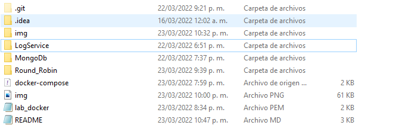


Donde round robin funciona como un balanceador de carga para log services

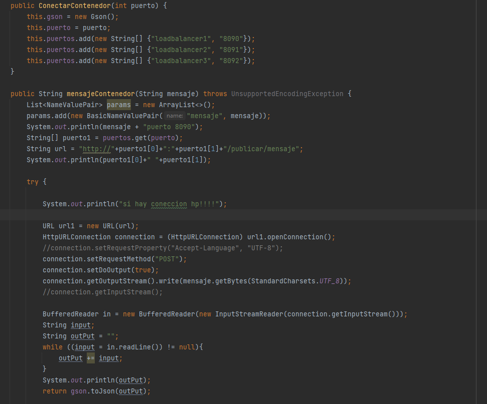

Pasamos a log service donde realiza la peticion al mongo agregando la fecha y el mensaje a la petición

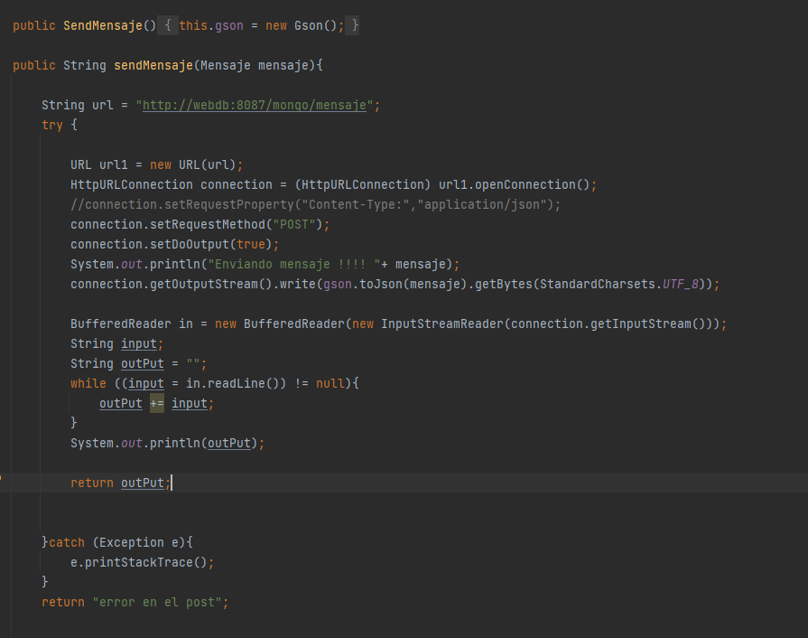

Finalmente mongoDb realiza la coneccion a la base de datos y realiza la insercion del mensaje con la fecha actual y realiza
el retorno de la consulta de todos los mensajes de la base de datos

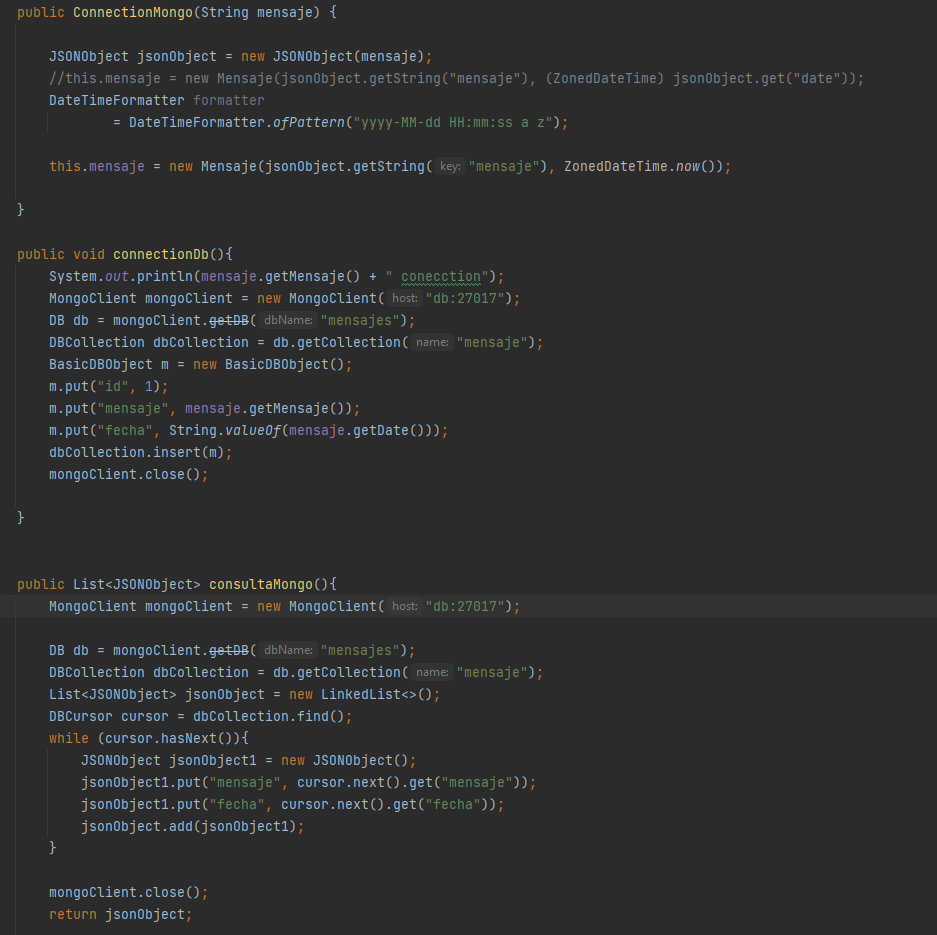

#Arquitectura 
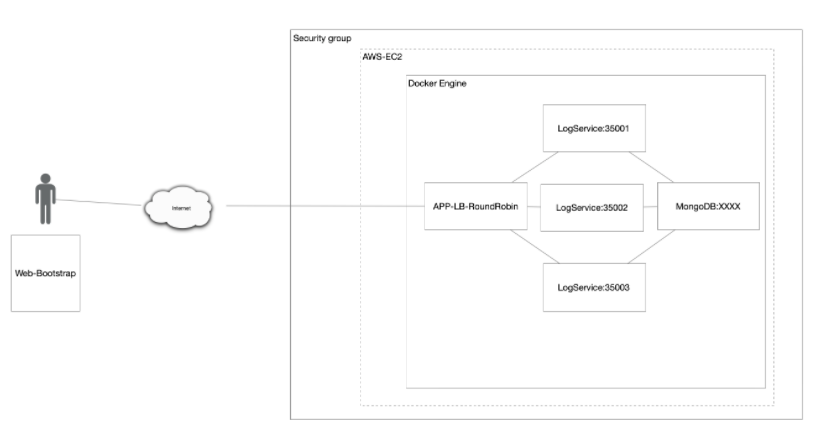

Esta es una arquitectura cliente servidor en donde el servidor Round-Robin sirve como un balanceador de carga que
distribulle las peticiones a 3 contenedores diferentes que a su ves que conectan a un contenedor de mongodb.


# Installation Imagines en AWS

Primero que todo creamos una maquina EC2 en AWS

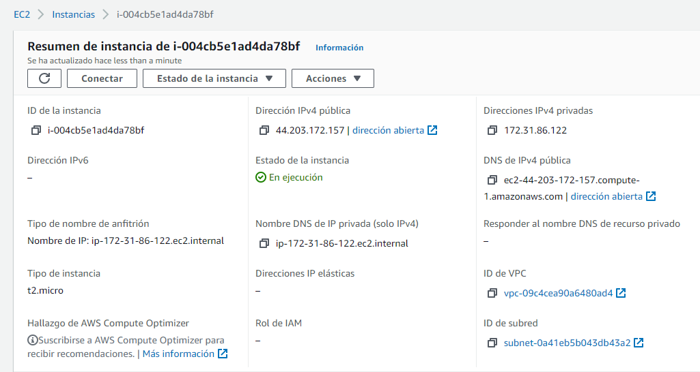

Una vez ya tenemos todo el proyecto realizado lo cargamos como un archivo zip

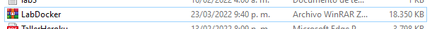

Ahora nos conectamos a nuestra maquina EC2 atravez del siguiente comando  ```` sftp -i "lab_docker.pem" ec2-user@ec2-44-203-172-157.compute-1.amazonaws.com ````
una vez adentro de la maquina escribimos lo siguiente ```` put LabDoker.zip````

Ahora ingresamos a nuestra maquina virtual con el siguiente comando ```` ssh -i "lab_docker.pem" ec2-user@ec2-44-203-172-157.compute-1.amazonaws.com ````
Y una vez dentro podemos ver nuestros documentos con ```` ls ````
Ahora hacemos ```` unzip LabDocker.zip ```` para poder extraer el proyecto y poder usarlo

Ahora necesitamos instalar docker y docker compose con los siguientes comandos

Docker ```` yum install Docker ````

Docker Compose ````sudo curl -L "https://github.com/docker/compose/releases/download/1.29.2/docker-compose-$(uname -s)-$(uname -m)" -o /usr/local/bin/docker-compose````

````sudo chmod +x /usr/local/bin/docker-compose````

Una vez hecho esto entramos a nuestra carpeta de ````LabDocker```` y ubicamos nuestro archivo ````docker-compose.yml```` y corremos el siguiente comando ```` docker-compose up -d````
con esto construiremos las imagenes y contenedores de Docker

**Para poder ver las imagenes procedemos a escribir el siguiente comando docker images**


##Images en Docker AWS

``` docker images ```

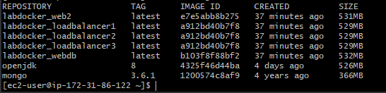

Aca podemos ver la instancia de mongo y las 5 images


##Contenedores en Docker AWS

``` docker ps ```

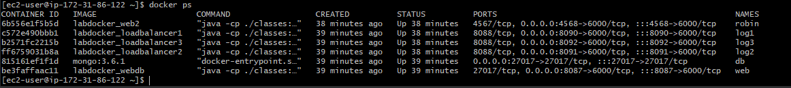

Aca podemos ver los 5 contenedores y la instancio a mongodb

## Habilitar puertos en AWS

Ahora procedemos habilitar los puertos en AWS

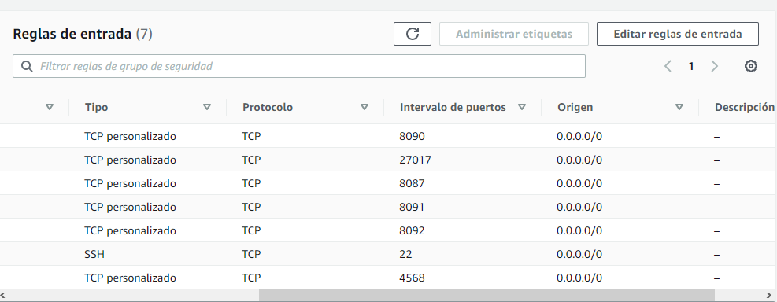


# Pruebas

Una vez ya construidas las images y contenedores y los puertos habilitados podemos ingresar a un navegador y poner la 
url publica de nuestra maquina

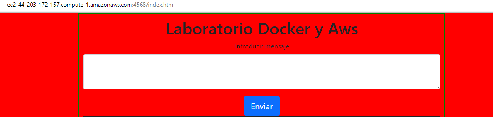

miramos que tengamos coneccion a nuestra base de datos atravez de dbeaver realizando la coneccion por url 

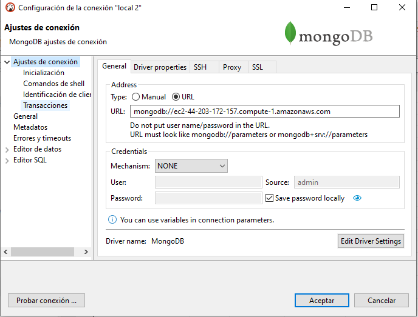

Vemos que efectivamente esta nuestra base datos y las colecciones creadas

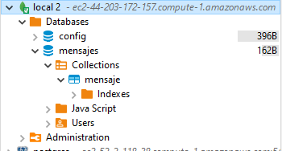

Ahora probamos nuestro servicio y vemos que efectivamente nos regresa mensajes anteriores y los que mandamos previamente

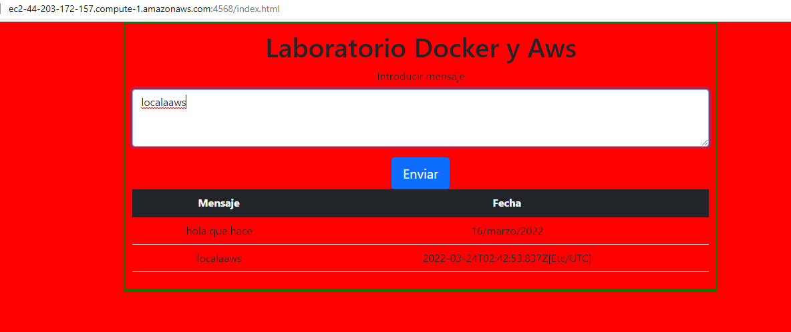

Vemos que efectivamente nos funciona nuestra arquitectura


## Author

- [Edward Daniel Porras Martin](https://github.com/Daniel19902)

## Build with

- Docker
- AWS
- Spark
- MongoDB
- Maven


